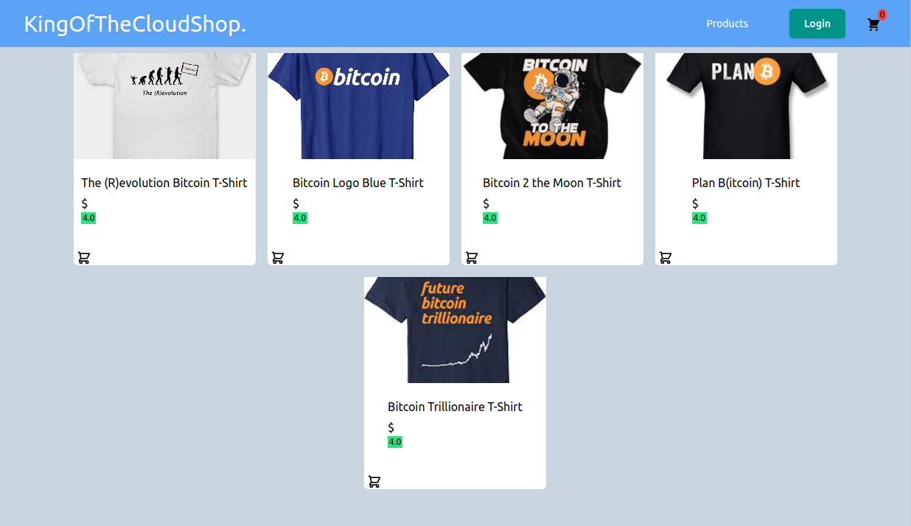

# AWS: King Of The Cloud-Ecommerce Website

Es una simple pagina de Ecommerce hecha en React + tailwind CSS que creamos para ir desarrollando y evolucionando a traves de las diferentes clases.

## Home Page



## Quick Start

### Requisito Previo

Para poder correr el proyecto tenes que tener instalado `React`, para eso tambien vas a necesitar tener instalado `Nodejs` y `NPM`.

### Iniciar el proyecto

Instalar todas las dependencias necesarias para el proyecto:

```
npm install
o
yarn
```

En el archivo _package.json_ en la raiz del proyecto, hay una seccion de _scripts_ en donde se encuentran todos los comandos preconfigurados del proyecto para ciertas acciones. Entre ellas las de arrancar el server para desarrollo.Que va a intentar correr el proyecto segun los archivos en _/src_.

Para iniciar el proyecto en desarrollo en el puerto 3000:

```
npm run start
o
yarn start
```

### Empaquetar el proyecto para subirlo a AWS S3

Para esto necesitamos que React nos empaquete la pagina web que estamos desarrollando en una version estatica y optimizada para que sea lo mas pequena posible.

```
npm run build
o
yarn build
```

Esto nos va a dejar los archivos para la pagina web estatica optimizada en _/build_

## Possible Future Additions:

- Third Party Payment Integration
- Third Party Auth like Google, Facebook, etc.
- Recaptcha for security
- Reccommendations/ Frequently Bought Together
- Forgot Password
- For-You-Page based on favorites and previous orders
